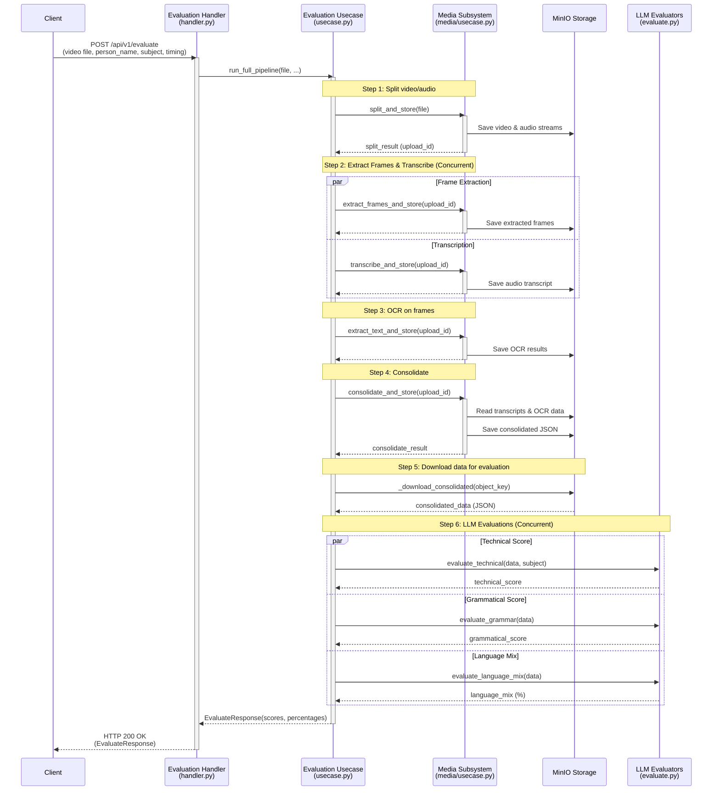

# Multimodal-Lecture-Evaluation-Pipeline
Multimodal Lecture Evaluation Pipeline is a multimodal lecture assessment engine that evaluates educational videos using speech recognition, OCR, visual understanding, and LLM-based reasoning. It extracts spoken content, on-screen text, handwritten notes, and diagrams, consolidates them into a unified knowledge representation, and generates objective scores for technical accuracy, grammar quality, and language usage.

The LLM used for OCR and evaluation is pluggable: it runs against a local **Ollama** server by default, or any **OpenAI-compatible** endpoint (OpenAI, vLLM, Together, LM Studio, …) — selected via the `LLM_PROVIDER` setting. See [Configuration](#configuration).

Designed for academic institutions, training platforms, and quality assurance workflows, the system produces explainable, rubric-driven evaluations from raw lecture recordings with minimal human intervention.

Core capabilities

Speech-to-text for multilingual lectures
Typed text and handwriting extraction
Diagram and visual content understanding
English/Tamil/Tanglish language analysis
Grammar and communication quality scoring
Technical correctness evaluation using LLMs
Weighted rubric-based scoring and report generation

Input: Lecture video
Output: Technical score, grammar score, language-mix analysis, and detailed evaluation report.

## API usage

Evaluation runs **asynchronously** — a lecture can take many minutes, so the pipeline
does not block the HTTP request.

1. **Submit** a video and get a job id back immediately:

   ```bash
   curl -X POST http://localhost:8000/api/v1/evaluate \
     -F video=@lecture.mp4 \
     -F person_name="Alice" \
     -F subject="Databases" \
     -F timing="45m"
   # -> 202 Accepted: {"job_id": "…", "status": "queued"}
   ```

2. **Poll** for progress and the final scores:

   ```bash
   curl http://localhost:8000/api/v1/evaluate/{job_id}
   # running:   {"status":"running","stage":"ocr", ...}
   # completed: {"status":"completed","result":{"technical_score":…, ...}}
   # failed:    {"status":"failed","error":"…"}
   ```

Job status is persisted in MinIO (`jobs/{job_id}.json`), so it can be polled from any
worker and survives restarts. The individual `/api/v1/media/*` stage endpoints remain
available for running the pipeline step by step.

### Grounding the technical score (optional)

Pass `reference_material` (an authoritative source — syllabus, textbook excerpt, notes)
to ground the technical evaluation. When supplied, the most relevant passages are
retrieved and the model scores correctness **against the reference** rather than on its
prior knowledge alone:

```bash
curl -X POST http://localhost:8000/api/v1/evaluate \
  -F video=@lecture.mp4 -F person_name="Alice" -F subject="Databases" -F timing="45m" \
  -F reference_material="A B-tree of order m has at most m children ... (reference text)"
```

## Accuracy features

- **Subject-biased transcription** — the lecture subject is fed to Whisper as an initial
  prompt to improve recognition of domain terms and proper nouns (`WHISPER_BIAS_WITH_SUBJECT`).
- **Slide de-duplication** — near-identical slide frames (the same slide re-captured across
  scenes) are removed with a perceptual hash before OCR, saving cost and preventing repeated
  slides from over-weighting the visual content (`FRAME_DEDUP_*`).
- **Grounded technical scoring (RAG-lite)** — when `reference_material` is supplied, relevant
  passages are retrieved with a dependency-free TF-IDF ranker and injected into the rubric so
  correctness is judged against the source (`GROUNDING_*`). No vector database required; the
  retriever is isolated so it can later be swapped for embeddings.

The sequence below shows the underlying stages the background job executes:


## Configuration

All configuration is centralised in `app/core/config.py` (`Settings`) and read
from environment variables / a `.env` file. Copy `.env.example` to `.env` and
adjust. Key settings:

| Variable | Default | Purpose |
| --- | --- | --- |
| `LOG_LEVEL` | `INFO` | Log verbosity (logs are structured JSON via structlog). |
| `MINIO_ENDPOINT` / `MINIO_ACCESS_KEY` / `MINIO_SECRET_KEY` | `localhost:9000` / `minioadmin` / `minioadmin` | Object storage connection. |
| `MINIO_DEFAULT_BUCKET` | `lectures` | Bucket for all pipeline artifacts. |
| `WHISPER_DEVICE` / `WHISPER_COMPUTE_TYPE` / `WHISPER_MODEL_SIZE` | `cuda` / `float16` / `large-v3` | faster-whisper transcription backend. |
| `LLM_PROVIDER` | `ollama` | LLM backend: `ollama` or `openai` (any OpenAI-compatible endpoint). |
| `OLLAMA_HOST` | `http://localhost:11434` | Ollama server (when `LLM_PROVIDER=ollama`). |
| `OPENAI_BASE_URL` / `OPENAI_API_KEY` | `https://api.openai.com/v1` / — | OpenAI-compatible endpoint (when `LLM_PROVIDER=openai`). |
| `LLM_EVAL_MODEL` / `LLM_OCR_MODEL` | `llama3.2` / `llava-phi3` | Text-scoring and vision-OCR models. |
| `LLM_MAX_RETRIES` / `LLM_TIMEOUT_SECONDS` | `2` / `120` | Resilience around LLM calls. |
| `OCR_MAX_WORKERS` | `0` (auto) | Parallel OCR concurrency. |
| `WHISPER_BIAS_WITH_SUBJECT` | `true` | Bias transcription toward the subject's vocabulary. |
| `FRAME_DEDUP_ENABLED` / `FRAME_DEDUP_HAMMING_THRESHOLD` | `true` / `5` | De-duplicate near-identical slide frames before OCR. |
| `GROUNDING_TOP_K` / `GROUNDING_CHUNK_CHARS` | `6` / `1200` | Reference-material retrieval for grounded technical scoring. |

The legacy `OLLAMA_EVAL_MODEL` / `OLLAMA_OCR_MODEL` / `OLLAMA_EVAL_SEED` names are
still accepted for backward compatibility.

### Switching to an OpenAI-compatible provider

```env
LLM_PROVIDER=openai
OPENAI_BASE_URL=https://api.openai.com/v1   # or your vLLM / gateway URL
OPENAI_API_KEY=sk-...
LLM_EVAL_MODEL=gpt-4o-mini
LLM_OCR_MODEL=gpt-4o-mini                    # must be vision-capable
```

## Operations

- **Health / readiness:** `GET /health` is a liveness probe; `GET /ready` verifies
  MinIO connectivity and returns per-dependency status for orchestrator readiness probes.
- **Request tracing:** every request is tagged with a `request_id` (honouring an
  inbound `X-Request-ID` header, else generated) that is bound to every log line
  for that request and echoed back in the `X-Request-ID` response header.
